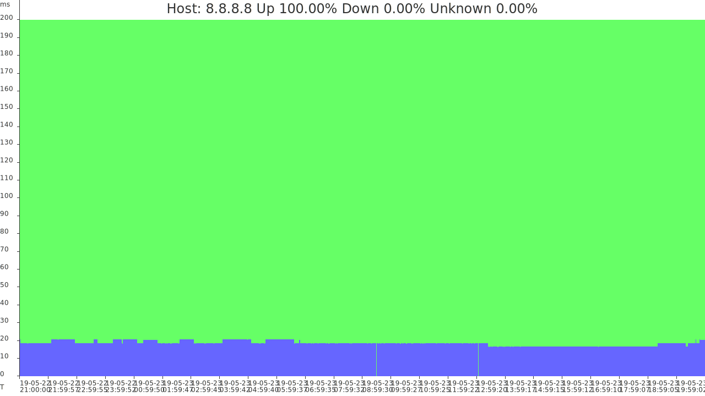

# Gosrvmon

Gosrvmon is a free, open-source, self-hosted uptime monitoring system.

Gosrvmon periodically performs server availability checks using ICMP (ping), TCP or HTTP/HTTPS requests. Check results and response time are stored in database. Results can be presented as SVG chart or as raw json data. All data can be accessed via simple web interface or using POST or GET requests. Results from multiple monitoring instances can be combined into a s single chart.

Chart example:


## Setup

ICMP (ping) checks require permission to create raw socket. This can be done by running application as root or by granting permission using capabilities:

```
setcap cap_net_raw+ep gosrvmon
```

By default configuration will be loaded from `config.json` located in the same working directory as the binary file. A custom path for configuration file can be set using `-config` option:

```
gosrvmon -config /etc/gosrvmon.json
```

A sample configuration can be found in [config.json](config.json) file.

Gosrvmon requires a database to store the resulting data. It can use PostgreSQL or an embedded database which will write the data to a single file. It can also store data in-memory. In-memory data is reset on every application restart.

PostgreSQL or embedded database require structure initialisation. In-memory database does not require initialisation. After initial configuration is done to perform database initialisation gosrvmon can be run with `-init` option.

```
gosrvmon -config /etc/gosrvmon.json -init
```

PostgreSQL can also be initialised manually using [init.sql](init.sql).

Host can be added by domain name or by IP address. Check method is selected based based on how a how a host is added for monitoring. `http://example.org/` would result in HTTP check. `example.org:80` would result in TCP check. `example.org` would result in ICMP check. IPv6 hosts are also supported (for example `http://[2606:2800:220:1:248:1893:25c8:1946]\`, `[2606:2800:220:1:248:1893:25c8:1946]:80` , `2606:2800:220:1:248:1893:25c8:1946`). If host is added by domain name which has multiple A and AAAA records and ICMP check method is used then the request will be sent to every address and host is considered online if any of the addresses sends the response.

## Configuration

### DB
 * `Type` - can be `"pq"` for PostgreSQL, `"ql"` for ql embedded database or left blank `""` for in-memory database.
 * `Host` - host for PostgreSQL connection.
 * `Port` - port for PostgreSQL connection.
 * `User` - user name for PostgreSQL connection.
 * `Password` - password for PostgreSQL connection.
 * `Database` - database name for PostgreSQL connection or path to database file for ql embedded database.
 
### Listen
 * `Address` - address on which the embedded web server should listen. Can be left blank `""` for listening an all available interfaces.
 * `Port` - port on which the embedded web server should listen.
 * `ReadTimeout` - read timeout for embedded web server.
 * `WriteTimeout` - write timeout for embedded web server.

#### WebAuth
 * `Enable` - if enabled actions like adding or removing hosts would require basic http authentication.
 * `User` - user name for basic http authentication.
 * `Password` - password for basic http authentication.
 
### Checks
 * `Timeout` - timeout after which the host is considered to be offline.
 * `Interval` - how often the checks should be performed.
 * `PingRetryCount` - number of ping attempts for ICMP check.
 * `HTTPMethod` - which http method to use in requests. Can be `"GET"` for standard GET requests of `"HEAD"` for requesting only page headers.
 * `PerformChecks` - if enabled periodic checks will be performed. When disabled the application will not perform any checks and will only serve historic data or display data aggregated from other instances.
 * `UseRemoteChecks` - if enabled application will request additional checks data from remote servers. If multiple servers monitor the same host then in the resulting chart the host will be considered online if at least one server was able to connect to it. If multiple servers were able to connect to the host then the lowest latency will be displayed.
 * `RemoteChecksURLs` - an array of servers from which additional data will be requested. Multiple servers can be set like this : `[ "http://192.168.1.1:8000/api/checks", "http://192.168.1.2:8000/api/checks" , "http://192.168.1.3:8000/api/checks" ]`
 * `AllowSingleChecks` - if enables single checks of host current state can be performed. The result of this check will be presented as json data or in web interface and will not be stored to database.
